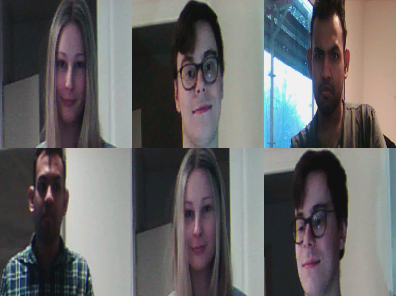

# EITP40 - Machine Learning for IoT @ LTH 2022 Project
## By: Simon Erlandsson & Nikhil Challa

Preview of the dataset used in the project, consisting of three classes.

### Introduction
This repository contains the code and assets used for the project in the ML IoT course @ LTH. Our project aims to perform on-device facial recognition and classification using the Arduino camera, by utilizing distributed on-device DNN learning.

Due to time constraints and reduction in team size (5 -> 2 persons), the goal of the project was simplified to consist of on-device deep neural network learning, using the output from a CNN running in Python as input. In the end, we achieved the following:

- Created a data-set consisting of facial images captured using the device camera (Arduino 33 BLE) with 3 classes
- Used the images to train a CNN with a DNN part, using Tensorflow (on PC)
- Removed the DNN part of the model, while fixing the CNN weights
- Exported the output from the CNN for the data-set to .h format (for the device)
- Tensorflow simulation of training only the DNN part using the CNN output
- On-device training for DNN, using the CNN output
- Distributed on-device training for DNN: two Arduinos contributing towards improving the model
- Validation using two biased data-sets: one label present exclusively on each device

### Authors
The project was mainly done by Simon Erlandsson and Nikhil Challa, with some contributions from the earlier team members: Evelyn Beck, Edvin Jönsson, and Gloria Mokberi.

Nikhil worked on creating a framework for the trainable neural network written in C. The outcome is a fully customizable (in terms of layer structure) effective implementation of forward- and backward propagation using ReLU or Softmax activation functions.

Nikhil also worked on providing functions for extracting the weights and biases from the NN into a contiguous vector, ready for transmission. This also included merging existing NN weights (averaging) with the incoming vector (master), as well as simply replacing the current weights with the incoming (slave).

Simon mainly worked on the Bluetooth communication between the IoT devices. The result is a framework capable of transmitting arrays of an arbitrary size and type between two devices, by sending the data in smaller batches (packets) and combining the batches on the receiving end. The framework also includes turn based sending and receiving, with the repeating structure:

- Master -> weights to slave
- Slave & master trains
- Slave -> weights to master
- Master aggregates (merges) the incoming weights with its own

The code is generalized to allow more than two devices (i.e. more than one slave, but still only one master), but due to time constraints testing and further development of this feature was paused.

Simon also worked on the Tensorflow and Python parts of the project, consisting of the image collection, image transformation, model creation, feature extraction and export, and isolated DNN training and validation. The earlier group members had started working partially on the tasks, so some of their contributions were reused.

Furthermore, both Nikhil and Simon discussed many aspects of the project and both were key contributors towards finishing the project on time. Tasks performed by both consist of: concretizing the idea and goal, collecting images, writing the main Arduino file, debugging and testing, and compiling the report and documentation.

### Git Folder and File Structure:
Explanation of the purpose of most of the folders/files in the repository.
- Before_Group_Split: raw work by prior group members:
  - Evelyn: translating between 565 and 888 image format, transforming datasets from the web & capturing images from the Arduino

  - Tensor_Single: Edvin & Gloria, Tensorflow model for classification of online images consisting of celebrities

- Datasets: the images used for the training and validation (Simon, Nikhil, Maria):
  - Images_for_Training: raw output from the scripts in "Misc/Image_Dump_From_Arduino"

  - Images_Transformed_565_160_120: numpy arrays of the output above, transformed to resolution 160x120 with 565 image coding. Done using "Misc/transform_camera_images.ipynb"

- Distributed_DNN_On_Device: the final Arduino code: both NN and BLE
  - BLE_central.h: BLE code for slave
  - BLE_peripheral.h: BLE code for master (the one merging the weights)
  - cnn_data_biased_*.h: The biased data used to verify that the model is  improving by utilizing the distribution
  - cnn_data.h: Full data, i.e. whole dataset is present in the file
  - distributed_dnn_on_device.ino: Main file, controller between BLE and NN

  - NN_functions.h: NN implementation

- DNN_On_Device_Training: isolated development of the DNN in C for Arduino
  - DNN_one_Device_From_CNN: first implementation of using the output from the CNN to train locally

  - DNN_Sample_Code: first implementation of NN in C/Arduino

- Misc: small programs/scripts that don't belong elsewhere
  - Image_Dump_From_Arduino:

    - capture_image_loop.ipynb: interactive notebook for capturing, viewing and saving images from the Arduino

    - capture_img.py: helper functions to the notebook

    - Image_Dump_From_Arduino.ino: the Arduino code used when capturing images

 - Transform_Camera_Images.ipynb: takes the images obtained above, processes them into a standardized format and exports the images and classes to numpy files

- Networking: isolated development of bluetooth communication between Arduinos
  - 2_devices_batch_final: Latest version before merge with DNN. Works with two devices and sending large data by splitting into smaller batches
  - Older versions:

    - 3 devices: first version using 3 devices, most of this work is kept in "2_devices_batch_final", may contain bugs

    - first_version_2_devices: no batching, only sends one struct per iteration

- Tensorflow_Python: the final code for training and utilizing the CNN to provide input data to device
  - Model_Final: exported Tensorflow model, CNN + DNN

  - Tensorflow_Main.ipynb: contains all code for importing the datasets, normalizing, creating the model and validation, fixing the CNN weights, exporting CNN output to .h, simulating on-device training by only training a DNN based on the CNN output and validating

  - Tensorflow_Old_Models: other models which were discarded due to complexity

Note that there are deviations from the Bluetooth and NN code in the final Arduino code. The latest version of all Arduino code is in the "Distributed_DNN_On_Device" folder.
